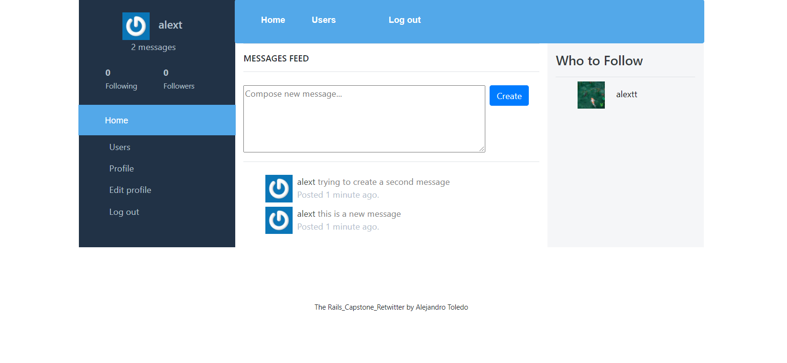

# ReTwitter Messages App

the app was built for the RoR Project and the intention is to create an app similar to Twitter.
In this app you can create an account, follow people and create message where you can talk about many topics as you wish.

## Images

## Built and tested With

- Ruby 2.7.0
- Ruby on Rails 6.1.0
- Rspec
- Postgres: >=9.5

## Live Demo of the app

[Click on this link](https://afternoon-beach-90148.herokuapp.com/)

## Video of Demostration

[Click on this link](https://www.loom.com/share/087cf731e6ce433086aa8da1720b5097)

## Setup

Download the repo with this command

`git clone https://github.com/alejandrotoledoweb/rails_capstone_retwitter.git`
`cd rails_casptone_retwitter`

Install the Gems and Dependencies

`bundle install`

Migrate the database and models

`rails db:migrate`
`rails db:seed`

## For the usage

Run the server

`rails server`

Open in the browser `http://localhost:3000/`

## Run the test 

Run this command

`rspec`

## Author

👤 **Alejandro Toledo**

- GitHub: [@alejandrotoledoweb](https://github.com/alejandrotoledoweb)
- Twitter: [@alejot](https://twitter.com/alejot) 
- LinkedIn: [Alejandro Toledo](https://www.linkedin.com/in/alejandro-toledo-3b444b109/) 

## 🤝 Contributing

Contributions, issues and feature requests are welcome!

Feel free to check the [issues page](issues/).

## Show your support

Give a ⭐️ if you like this project!

## Acknowledgments

- Project inspired by the work of [Gregoire Vella](https://www.behance.net/gallery/14286087/Twitter-Redesign-of-UI-details)

## 📝 License

This project is [MIT](https://opensource.org/licenses/MIT) licensed.

